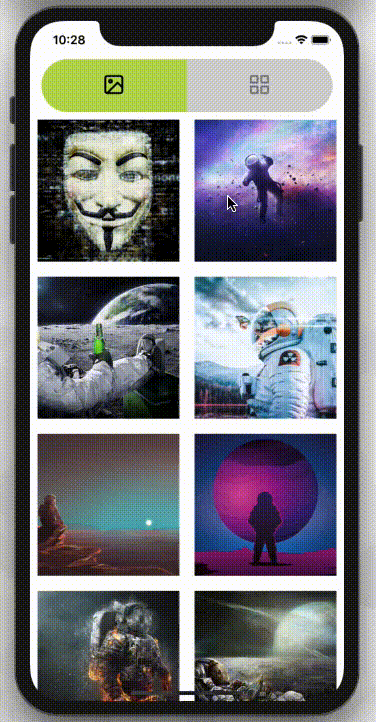

    

  <a href="#projeto">Projeto</a>&nbsp;&nbsp;&nbsp;|&nbsp;&nbsp;&nbsp;
  <a href="#tecnologias">Tecnologias</a>&nbsp;&nbsp;&nbsp;|&nbsp;&nbsp;&nbsp;
  <a href="#setup">Setup</a>&nbsp;&nbsp;&nbsp;|&nbsp;&nbsp;&nbsp;
  <a href="#layout">Layout</a>&nbsp;&nbsp;&nbsp;|&nbsp;&nbsp;&nbsp;
  <a href="#licença">Licença</a>

## Projeto

Estudo de aprimoramento em animações com React Native. Transições reanimadas, Tab Bar e imagens aleatórias.

## Tecnologias

Esse projeto Backend, foi desenvolvido com as seguintes tecnologias:

- [JavaScript](https://developer.mozilla.org/pt-BR/docs/Web/JavaScript)
- [Node.js](https://nodejs.org/en/)
- [React](https://reactjs.org)
- [React Native](https://facebook.github.io/react-native/)

## Setup

Clone o repositório em sua maquina:

`git clone https://github.com/BrunoLagoa/ShuffleImages.git`

- Abra as pastas e execute `yarn install` para instalar todas as dependencies
- Abra as pastas e execute `yarn start` para iniciar o servidor

## Layout

    

## Licença

Esse projeto está sob a licença MIT. Veja o arquivo [LICENSE](LICENSE.md) para mais detalhes.

---

[Bruno Castro](http://www.brunocastro.dev) - [bruno@bhzautomacao.com.br](mailto:bruno@bhzautomacao.com.br) - Development
